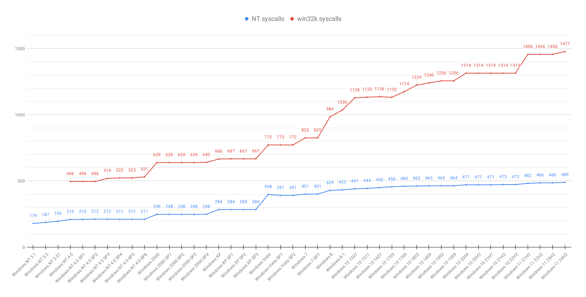

# Windows System Call Tables

The repository contains system call tables collected from all modern and most older releases of Windows, starting with Windows NT.

Both 32-bit and 64-bit builds were analyzed, and the tables were extracted from both the core kernel image (`ntoskrnl.exe`) and the graphical subsystem (`win32k.sys`).

## Formats

The data is formatted in the CSV and JSON formats for programmatic use, and as an HTML table for manual inspection.

The HTML files are also hosted on my blog under the following links:

- `ntoskrnl.exe`, x86: https://j00ru.vexillium.org/syscalls/nt/32/
- `ntoskrnl.exe`, x64: https://j00ru.vexillium.org/syscalls/nt/64/
- `win32k.sys`, x86: https://j00ru.vexillium.org/syscalls/win32k/32/
- `win32k.sys`, x64: https://j00ru.vexillium.org/syscalls/win32k/64/

## Operating systems

The following major versions of Windows are included in the tables:

| System              | x86 versions                 												            | x64 versions                             |
|---------------------|-----------------------------------------------------------------|------------------------------------------|
| Windows NT 3.x      | 3.1, 3.5, 3.51                           												| -                                        |
| Windows NT 4.0      | SP0, SP1, SP2, SP3, SP3 Terminal Server Edition, SP4, SP5, SP6  | –                                        |
| Windows 2000        | SP0, SP1, SP2, SP3, SP4                  												| –                                        |
| Windows XP          | SP0, SP1, SP2, SP3                       												| SP1, SP2                                 |
| Windows Server 2003 | SP0, SP1, SP2, R2, R2 SP2                												| SP0, SP2, R2, R2 SP2                     |
| Windows Vista       | SP0, SP1, SP2                            												| SP0, SP1, SP2                            |
| Windows 7           | SP0, SP1                                 												| SP0, SP1                                 |
| Windows 8           | 8.0, 8.1                                 												| 8.0, 8.1                                 |
| Windows 10          | 1507, 1511, 1607, 1703, 1709, 1803, 1809, 1903, 1909, 2004, 20H2, 21H1, 21H2, 22H2 | 1507, 1511, 1607, 1703, 1709, 1803, 1809, 1903, 1909, 2004, 20H2, 21H1, 21H2, 22H2 |
| Windows 11          | -                                        												| 21H2, 22H2, 23H2, 24H2                   |
| Windows Server      | -                                        												| 2022, 23H2                               |

Some older versions of Windows Server are not included, as their syscall tables are equivalent to these of desktop Windows editions:

| Windows Server version | Windows Desktop version |
|:----------------------:|:-----------------------:|
|      2008 SP0/SP2      |      Vista SP1/SP2      |
|    2008 R2 SP0/SP1     |        7 SP0/SP1        |
|        2012 SP0        |           8.0           |
|        2012 R2         |           8.1           |
|    2016 LTSC (1607)    |         10 1607         |
|          1709          |         10 1709         |
|          1803          |         10 1803         |
|    2019 LTSC (1809)    |         10 1809         |
|          1903          |         10 1903         |
|          1909          |         10 1909         |
|          2004          |         10 2004         |
|          20H2          |         10 20H2         |

## Historical system call counts

Below is a line chart showing the progression of Windows system call development over time. It covers all major desktop versions of Windows starting with Windows NT 3.1 released in July 1993, up to the most recent versions of Windows 11. Server editions are not included for brevity. The analysis was performed on x86 builds for consistency, with the exception of Windows 11 where x64 is the only supported platform. There might be very small differences on x64 builds of the kernel or the less popular editions (e.g. Windows NT 4.0 Terminal Server), but they are insignificant for the purpose of this overview chart.

## Thanks

We would like to thank the following contributors to the project: Woodmann, Deus, Gynvael Coldwind, MeMek, Alex, Omega Red, Wandering Glitch.

## Contact

Mateusz 'j00ru' Jurczyk (j00ru.vx@gmail.com)
